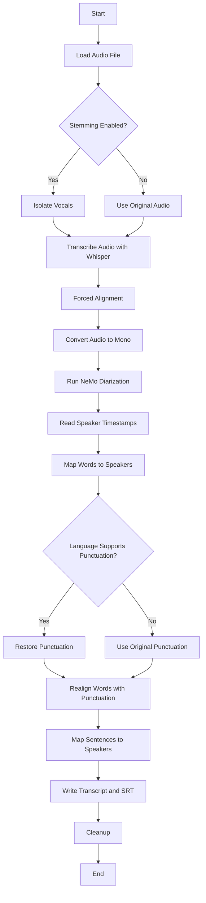
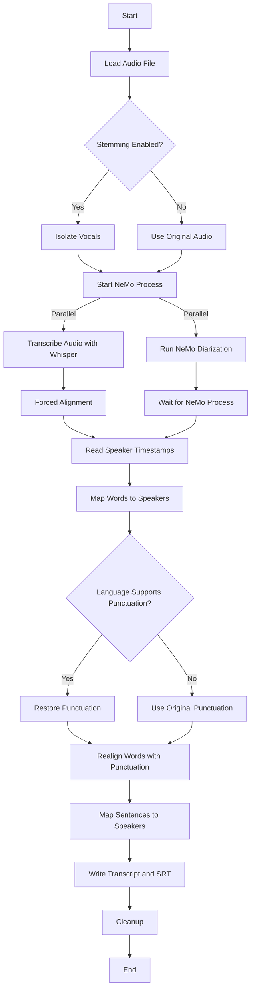

# Project Documentation

This document provides an overview of the files in this project, including their purpose, classes, methods, arguments, and outputs.

## Introduction

This project is designed to perform speaker diarization using OpenAI's Whisper for transcription and NVIDIA's NeMo for speaker diarization. This document will guide you through the architecture of the project, how to set it up, and how to contribute.

## Architecture

This section provides an overview of the architecture of the project, including how each file and external library fit together, what they pass to and from each other, and the frameworks/models/ML/AI components used.

### Text Description

The project is structured to perform speaker diarization using OpenAI's Whisper for transcription and NVIDIA's NeMo for speaker diarization. The main components are:

- **diarize.py**: Handles the main diarization process. It loads the audio file, optionally isolates vocals, transcribes the audio using Whisper, performs forced alignment, converts audio to mono, runs NeMo diarization, reads speaker timestamps, maps words to speakers, restores punctuation, realigns words with punctuation, maps sentences to speakers, writes the transcript and SRT files, and performs cleanup.
- **diarize_parallel.py**: Similar to `diarize.py` but runs NeMo and Whisper in parallel to speed up the process.
- **nemo_process.py**: Handles the NeMo process for diarization. It converts the audio to mono, initializes the NeMo MSDD diarization model, and runs the diarization.
- **helpers.py**: Contains various helper functions used throughout the project, including functions for creating configurations, mapping words to speakers, restoring punctuation, and writing transcripts.
- **transcription_helpers.py**: Contains functions for transcribing audio files using Whisper.

### Architecture Diagram

```mermaid
graph TD
    A[diarize.py] -->|Imports| B[helpers.py]
    A -->|Imports| C[transcription_helpers.py]
    A -->|Calls| D[Whisper ASR]
    A -->|Calls| E[NeMo Diarization]
    A -->|Calls| F[Forced Alignment]
    A -->|Calls| G[Punctuation Restoration]
    A -->|Calls| H[Write Transcript]
    A -->|Calls| I[Write SRT]
    A -->|Calls| J[Cleanup]

    B -->|Provides| K[create_config]
    B -->|Provides| L[get_words_speaker_mapping]
    B -->|Provides| M[get_realigned_ws_mapping_with_punctuation]
    B -->|Provides| N[get_sentences_speaker_mapping]
    B -->|Provides| O[get_speaker_aware_transcript]
    B -->|Provides| P[write_srt]
    B -->|Provides| Q[cleanup]

    C -->|Provides| R[transcribe]
    C -->|Provides| S[transcribe_batched]

    D -->|Uses| T[Whisper Model]
    E -->|Uses| U[NeMo MSDD Model]
    F -->|Uses| V[CTC Forced Aligner]
    G -->|Uses| W[Punctuation Model]
```



## File Summaries

### Diarization Process Flow



### Parallel Diarization Process Flow



### helpers.py

This file contains various helper functions used throughout the project.

#### Functions:

- **create_config(output_dir)**
  - **Arguments:**
    - `output_dir` (str): The directory where the output files will be stored.
  - **Returns:** 
    - A configuration object for the NeMo MSDD diarization model.

- **get_word_ts_anchor(s, e, option="start")**
  - **Arguments:**
    - `s` (int): Start time.
    - `e` (int): End time.
    - `option` (str): Anchor option ("start", "mid", "end").
  - **Returns:** 
    - The anchor timestamp based on the option.

- **get_words_speaker_mapping(wrd_ts, spk_ts, word_anchor_option="start")**
  - **Arguments:**
    - `wrd_ts` (list): List of word timestamps.
    - `spk_ts` (list): List of speaker timestamps.
    - `word_anchor_option` (str): Anchor option for words.
  - **Returns:** 
    - A list mapping words to speakers.

- **get_realigned_ws_mapping_with_punctuation(word_speaker_mapping, max_words_in_sentence=50)**
  - **Arguments:**
    - `word_speaker_mapping` (list): List of word-speaker mappings.
    - `max_words_in_sentence` (int): Maximum words in a sentence.
  - **Returns:** 
    - A realigned list of word-speaker mappings with punctuation.

- **get_sentences_speaker_mapping(word_speaker_mapping, spk_ts)**
  - **Arguments:**
    - `word_speaker_mapping` (list): List of word-speaker mappings.
    - `spk_ts` (list): List of speaker timestamps.
  - **Returns:** 
    - A list of sentences with speaker mappings.

- **get_speaker_aware_transcript(sentences_speaker_mapping, f)**
  - **Arguments:**
    - `sentences_speaker_mapping` (list): List of sentences with speaker mappings.
    - `f` (file object): File object to write the transcript.
  - **Returns:** 
    - None

- **format_timestamp(milliseconds, always_include_hours=False, decimal_marker=".")**
  - **Arguments:**
    - `milliseconds` (float): Time in milliseconds.
    - `always_include_hours` (bool): Whether to always include hours in the timestamp.
    - `decimal_marker` (str): Decimal marker.
  - **Returns:** 
    - Formatted timestamp string.

- **write_srt(transcript, file)**
  - **Arguments:**
    - `transcript` (list): List of transcript segments.
    - `file` (file object): File object to write the SRT.
  - **Returns:** 
    - None

- **find_numeral_symbol_tokens(tokenizer)**
  - **Arguments:**
    - `tokenizer` (object): Tokenizer object.
  - **Returns:** 
    - List of numeral symbol tokens.

- **filter_missing_timestamps(word_timestamps, initial_timestamp=0, final_timestamp=None)**
  - **Arguments:**
    - `word_timestamps` (list): List of word timestamps.
    - `initial_timestamp` (int): Initial timestamp.
    - `final_timestamp` (int): Final timestamp.
  - **Returns:** 
    - Filtered list of word timestamps.

- **cleanup(path)**
  - **Arguments:**
    - `path` (str): Path to the file or directory to be cleaned up.
  - **Returns:** 
    - None

- **process_language_arg(language, model_name)**
  - **Arguments:**
    - `language` (str): Language code or name.
    - `model_name` (str): Model name.
  - **Returns:** 
    - Processed language code.

### transcription_helpers.py

This file contains functions for transcribing audio files.

#### Functions:

- **transcribe(audio_file, language, model_name, compute_dtype, suppress_numerals, device)**
  - **Arguments:**
    - `audio_file` (str): Path to the audio file.
    - `language` (str): Language code.
    - `model_name` (str): Model name.
    - `compute_dtype` (str): Compute data type.
    - `suppress_numerals` (bool): Whether to suppress numerals.
    - `device` (str): Device to run the model on.
  - **Returns:** 
    - Tuple containing the transcription results and detected language.

- **transcribe_batched(audio_file, language, batch_size, model_name, compute_dtype, suppress_numerals, device)**
  - **Arguments:**
    - `audio_file` (str): Path to the audio file.
    - `language` (str): Language code.
    - `batch_size` (int): Batch size for batched inference.
    - `model_name` (str): Model name.
    - `compute_dtype` (str): Compute data type.
    - `suppress_numerals` (bool): Whether to suppress numerals.
    - `device` (str): Device to run the model on.
  - **Returns:** 
    - Tuple containing the transcription segments, detected language, and audio waveform.

### diarize_parallel.py

This file handles the parallel diarization process.

#### Functions:

- **main()**
  - **Arguments:** 
    - None
  - **Returns:** 
    - None

### nemo_process.py

This file handles the NeMo process for diarization.

#### Functions:

- **main()**
  - **Arguments:** 
    - None
  - **Returns:** 
    - None

### diarize.py

This file handles the diarization process.

#### Functions:

- **main()**
  - **Arguments:** 
    - None
  - **Returns:** 
    - None

## Configuration and Setup

### Environment Variables

List any environment variables that need to be set.

### Configuration Files

Describe any configuration files and their purpose.

## Examples

Provide examples of how to run the main scripts and what the expected output should look like.

### Basic Usage

To run the diarization process on an audio file:

```sh
python diarize.py -a path/to/audio/file.wav
```

### Using Parallel Diarization

If your system has enough VRAM (>=10GB), you can use `diarize_parallel.py` to run NeMo and Whisper in parallel:

```sh
python diarize_parallel.py -a path/to/audio/file.wav
```

### Disabling Source Separation

To disable source separation, which can be useful for long files that don't contain a lot of music:

```sh
python diarize.py -a path/to/audio/file.wav --no-stem
```

### Specifying Whisper Model

To specify a different Whisper model for ASR:

```sh
python diarize.py -a path/to/audio/file.wav --whisper-model large
```
Options are:
- `tiny`
- `tiny.en`
- `base`
- `base.en`
- `small`
- `small.en`
- `medium`
- `medium.en`
- `large`
- `large-v2`
- `large-v3`

### Suppressing Numerals

To transcribe numbers in their pronounced letters instead of digits, which improves alignment accuracy:

```sh
python diarize.py -a path/to/audio/file.wav --suppress_numerals
```

### Specifying Device

To specify which device to use (e.g., CPU or GPU):

```sh
python diarize.py -a path/to/audio/file.wav --device cpu
```

## Troubleshooting

This section provides a detailed table of the methods and functions in the project, including their input variables, output variables, and features.

| filename | class.method/method | variables_in | variables_out | features |
|----------|---------------------|--------------|---------------|----------|
| helpers.py | create_config | output_dir | config | configuration, NeMo, diarization |
| helpers.py | get_word_ts_anchor | s, e, option | timestamp | timestamp, anchor |
| helpers.py | get_words_speaker_mapping | wrd_ts, spk_ts, word_anchor_option | wrd_spk_mapping | mapping, words, speakers |
| helpers.py | get_realigned_ws_mapping_with_punctuation | word_speaker_mapping, max_words_in_sentence | realigned_list | punctuation, realignment |
| helpers.py | get_sentences_speaker_mapping | word_speaker_mapping, spk_ts | snts | sentences, speaker mapping |
| helpers.py | get_speaker_aware_transcript | sentences_speaker_mapping, f | None | transcript, speaker-aware |
| helpers.py | format_timestamp | milliseconds, always_include_hours, decimal_marker | formatted_timestamp | timestamp, formatting |
| helpers.py | write_srt | transcript, file | None | SRT, writing |
| helpers.py | find_numeral_symbol_tokens | tokenizer | numeral_symbol_tokens | tokenizer, numeral symbols |
| helpers.py | filter_missing_timestamps | word_timestamps, initial_timestamp, final_timestamp | result | timestamps, filtering |
| helpers.py | cleanup | path | None | cleanup, file, directory |
| helpers.py | process_language_arg | language, model_name | language | language processing, validation |
| nemo_process.py | main | args | None | NeMo, diarization, audio processing |
| diarize_parallel.py | main | args | whisper_results, language, audio_waveform, emissions, stride, word_timestamps, speaker_ts, wsm, ssm | NeMo, Whisper, forced alignment, punctuation restoration, speaker mapping, SRT writing, cleanup, parallel processing, audio processing |
| diarize.py | main | args | whisper_results, language, audio_waveform, emissions, stride, word_timestamps, speaker_ts, wsm, ssm | NeMo, Whisper, forced alignment, punctuation restoration, speaker mapping, SRT writing, cleanup, audio processing |
| transcription_helpers.py | transcribe | audio_file, language, model_name, compute_dtype, suppress_numerals, device | whisper_results, info.language | transcription, Whisper |
| transcription_helpers.py | transcribe_batched | audio_file, language, batch_size, model_name, compute_dtype, suppress_numerals, device | result["segments"], result["language"], audio | transcription, batched, Whisper |

## Contributing

Add guidelines for contributing to the project, including how to add new features or fix bugs.
